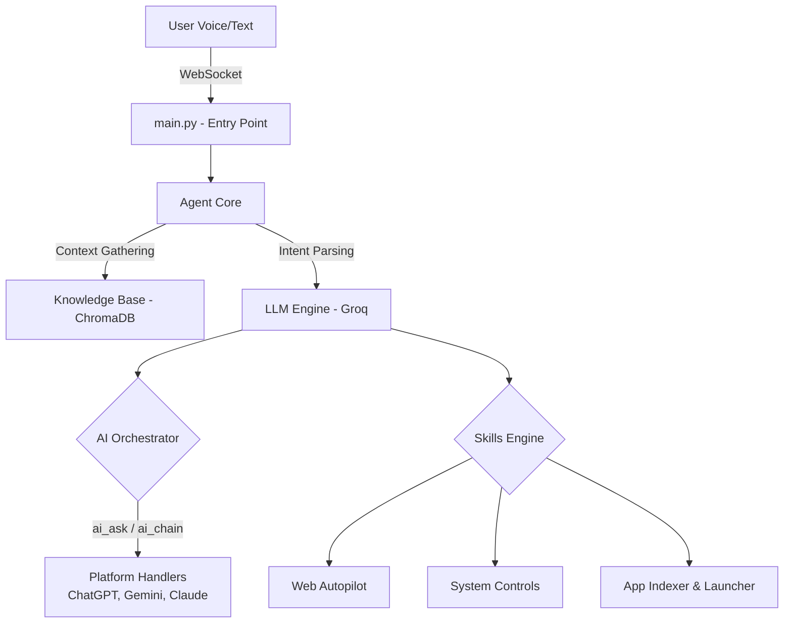

<div align="center">

# ⚡ MAX (Jarvis) AI Orchestration Engine


> An advanced, locally-hosted, agentic AI orchestration engine featuring continuous voice interactions, multi-model chaining, true multitasking, and autonomous web navigation.

</div>

---

## 🌟 Executive Summary

MAX is not just a voice assistant; it is a **multi-agent AI orchestration engine** designed to act as an operating system for your digital life. Built with a high-performance Python/FastAPI backend and a lightweight Rust/Tauri frontend, MAX handles everything from local system management to complex, cross-platform AI reasoning pipelines.

---

## 🚀 Core Capabilities

### 🧠 Multi-Model AI Orchestration (`ai_ask` & `ai_chain`)
MAX acts as a unified router for the world's most powerful LLMs (ChatGPT, Gemini, Claude, Copilot, Perplexity).
* **Direct Routing:** Tell MAX to *"Ask ChatGPT to write a React component."*
* **Cross-Model Chaining:** Chain cognitive processes across different models. Example: *"Get ChatGPT to write the code and use Gemini to review and optimize it."*

### 🎙️ Continuous Voice Engine
Powered by real-time Voice Activity Detection (VAD) and Groq's ultra-low latency transcription. Speak naturally without wake words or button presses. The engine intelligently debounces conversational fillers and intercepts commands flawlessly.

### 🌐 Autonomous Web Autopilot
A built-in autonomous web agent capable of resolving ambiguous URLs, conducting deep background research via DuckDuckGo, and manipulating the DOM using Selenium—all while you focus on other tasks.

### 🔄 True Multitasking
Unlike standard LLMs that execute sequentially, MAX parses complex compound intents (e.g., *"Play lofi music on YouTube, open my codebase, and set brightness to 50"*) and executes them with precise timing to prevent OS-level bottlenecks.

### 📚 RAG Knowledge Base
A local ChromaDB instance indexes your personal `.md` notes, CRM data, and tech stack architecture. MAX continuously injects this context into its prompts, eliminating hallucinations and personalizing its intelligence.

---

## 🏗️ System Architecture



---

## 📂 Repository Topology

The backend relies on a highly modularized, multi-agent design:

```text
backend/
├── main.py                     # WebSocket server & async event loop
├── agent_core.py               # Core LLM request lifecycle & orchestration
├── modules/                 
│   ├── ai_orchestrator/        # 🧠 Multi-LLM Routing & Workflow Chains
│   │   ├── ai_router.py        
│   │   ├── chain_engine.py     # Executes multi-model cognitive chains
│   │   └── platform_handler.py # Interfaces for external AI platforms
│   ├── skills.py               # ⚙️ Action Execution Engine
│   ├── llm.py                  # AI Prompt Engineering & Skill Extraction
│   ├── web_autopilot.py        # 🌐 Autonomous Web & Selenium Engine
│   ├── knowledge_base.py       # 📚 RAG & ChromaDB Integration
│   ├── gatekeeper.py           # Output Validation & Sanitization
│   └── (Various Agents)...     # browser_agent, email_agent, code_engine, etc.
```

---

## ⚡ Deployment & Installation

### Prerequisites
* **Python 3.9+**
* **Node.js 18+** & **npm**
* **Rust** (Required for the Tauri Desktop compiler)
* Active API Keys (Groq, OpenAI, Gemini, etc., depending on your orchestrator needs)

### Quick Start

1. **Environment Configuration**
   Clone the repository and configure your environment:
   ```bash
   cp env.example .env
   # Edit .env with your GROQ_API_KEY and other platform keys
   ```

2. **Install Dependencies**
   ```bash
   # Backend
   cd backend
   pip install -r ../requirements.txt

   # Frontend
   cd ../frontend
   npm install
   ```

3. **Ignition**
   Use the unified startup scripts to boot both the FastAPI backend and the frontend client simultaneously.
   * **Windows:** `./start.bat`
   * **Linux/MacOS:** `./start.sh`

---

## 🔧 Extensibility (Skill Forge)

MAX is designed to evolve. Using the built-in `Skill Forge`, the system can dynamically learn and generate new Python executable skills on the fly when it encounters an unknown intent, permanently expanding its capabilities without manual coding.

---
*Built with ❤️ for true autonomous desktop control.*
