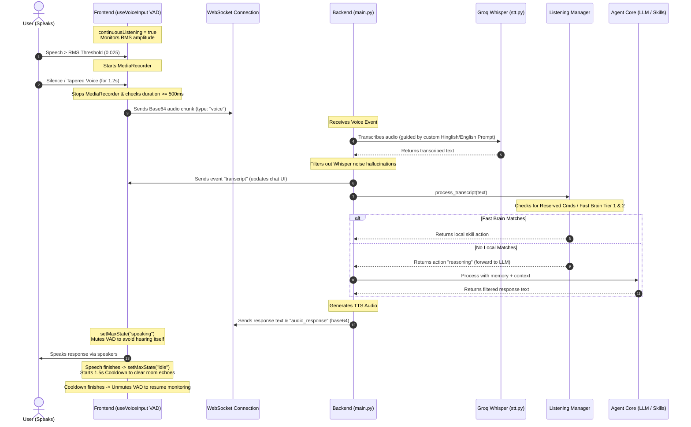

# Max Voice Assistant: Continuous Listening System & Logic Context

This document provides a complete, end-to-end context of how the **Continuous Listening (Ambient Listening) System** is designed, implemented, and coordinated between the Frontend (React web application/Tauri wrapper) and the Backend (FastAPI, WebSockets, Groq Whisper STT, and AI Agent Core). 

Any LLM reading this file can instantly understand the architecture, data flow, noise control strategies, and event handling loops.

---

## 1. Architectural Overview & Data Flow

The continuous listening system follows a decentralized logic pipeline. The **Frontend** acts as the primary "noise gate" (using Web Audio API for local Voice Activity Detection) to avoid wasting bandwidth, while the **Backend** acts as the "semantic filter" (using transcription prompts, hallucination ignore lists, and intent checks).



---

## 2. Frontend Voice Activity Detection (VAD) Logic

### Location: `frontend/src/hooks/useVoiceInput.js`

The frontend uses the HTML5 Web Audio API to analyze mic input. It tracks the **Root Mean Square (RMS)** amplitude of the incoming PCM signal and uses state locks to prevent feedback loops.

#### Core Initialization (Preventing Duplicate Audio Graph Nodes)
To prevent double command triggers, the browser session reuse-guards the AudioContext:
```javascript
const initAudio = async () => {
  // Guard clause: Reuse existing stream and AudioContext if already initialized
  if (streamRef.current && audioContextRef.current) {
    if (audioContextRef.current.state === 'suspended') {
      try {
        await audioContextRef.current.resume()
      } catch (e) {
        console.warn("Failed to resume AudioContext:", e)
      }
    }
    return
  }
  
  // First-time setup
  const stream = await navigator.mediaDevices.getUserMedia({
    audio: { echoCancellation: true, noiseSuppression: true, sampleRate: 16000 }
  })
  streamRef.current = stream

  const audioContext = new (window.AudioContext || window.webkitAudioContext)()
  audioContextRef.current = audioContext
  
  if (audioContext.state === 'suspended') {
    try { await audioContext.resume() } catch (e) { console.warn(e) }
  }
  
  const source = audioContext.createMediaStreamSource(stream)
  const analyser = audioContext.createAnalyser()
  analyser.fftSize = 256
  analyser.smoothingTimeConstant = 0.7
  source.connect(analyser)
  analyserRef.current = analyser

  // ScriptProcessor processes blocks of 4096 samples
  const processor = audioContext.createScriptProcessor(4096, 1, 1)
  processorRef.current = processor
  source.connect(processor)
  processor.connect(audioContext.destination)
  
  // Set up onaudioprocess handler
  processor.onaudioprocess = handleAudioFrame
}
```

#### RMS Volume Tracking and State Safeguards
The mic is automatically muted when Max is `speaking`, `thinking` (processing a request), or during a `1.5 second post-speech cooldown` (to let room echoes dissipate):

```javascript
processor.onaudioprocess = (e) => {
  // Safeguard: Mute mic when MAX is thinking/speaking or during post-speech cooldown
  const isMuted = jarvisStateRef.current === 'speaking' || 
                  jarvisStateRef.current === 'thinking' || 
                  cooldownActiveRef.current

  if (!isContinuousActiveRef.current || isMuted) {
    if (isSpeakingRef.current) {
      isSpeakingRef.current = false
      setIsRecording(false)
      stopCurrentRecordingAndEmit()
    }
    return
  }

  const input = e.inputBuffer.getChannelData(0)
  let sum = 0.0
  for (let i = 0; i < input.length; i++) {
    sum += input[i] * input[i]
  }
  const rms = Math.sqrt(sum / input.length)
  
  const threshold = 0.025 // Noise threshold (ignores low-level background room hum/fans)

  if (rms > threshold) {
    // User started speaking
    if (!isSpeakingRef.current) {
      isSpeakingRef.current = true
      setIsRecording(true)
      startNewRecording() // Triggers MediaRecorder.start()
    }
    if (silenceTimerRef.current) {
      clearTimeout(silenceTimerRef.current)
      silenceTimerRef.current = null
    }
  } else {
    // Silence detected: Wait 1200ms before finishing chunk to capture natural speaking pauses
    if (isSpeakingRef.current && !silenceTimerRef.current) {
      silenceTimerRef.current = setTimeout(() => {
        isSpeakingRef.current = false
        setIsRecording(false)
        stopCurrentRecordingAndEmit() // Triggers MediaRecorder.stop()
        silenceTimerRef.current = null
      }, 1200)
    }
  }
}
```

#### Stop, Emit, and Post-Speech Cooldown
- **Short Audio Discard**: Click noises, brief animal barks, and sighs (under `500ms`) are discarded.
- **PTT Re-enable Delay**: A `1000ms` safety delay is applied before unmuting continuous mode after a manual push-to-talk button is released.
- **Echo Cooldown**: When Max finishes speaking and goes back to `idle`, a `1500ms` cooldown is activated.

```javascript
const stopCurrentRecordingAndEmit = () => {
  if (currentRecorder && currentRecorder.state !== 'inactive') {
    currentRecorder.onstop = () => {
      const blob = new Blob(currentChunks, { type: 'audio/webm' })
      const duration = Date.now() - speakingStartRef.current
      
      // Noise Guard: Only emit if chunk duration is >= 500ms
      if (blob.size > 1500 && duration >= 500 && onSpeechCapturedRef.current) {
        onSpeechCapturedRef.current(blob)
      }
    }
    currentRecorder.stop()
  }
}

const updateJarvisState = useCallback((state) => {
  // echo loop prevention when transitioning from speaking/thinking -> idle
  if ((jarvisStateRef.current === 'speaking' || jarvisStateRef.current === 'thinking') && state === 'idle') {
    cooldownActiveRef.current = true
    if (cooldownTimerRef.current) clearTimeout(cooldownTimerRef.current)
    cooldownTimerRef.current = setTimeout(() => {
      cooldownActiveRef.current = false
    }, 1500) // 1.5 seconds cooldown
  }
  jarvisStateRef.current = state
}, [])
```

---

## 3. WebSocket Event Communication Pipeline

### Location: `frontend/src/hooks/useWebSocket.js` & `frontend/src/App.jsx`

When a speech segment is finalized and emitted by the VAD hook, the application converts the `.webm` audio blob to a base64-encoded string and transmits it via WebSocket:

```javascript
// App.jsx -> handleSpeechCaptured
const handleSpeechCaptured = useCallback(async (audioBlob) => {
  if (!audioBlob || audioBlob.size < 512) return
  setMaxState('thinking') // Mutexes VAD on frontend immediately
  try {
    const base64 = await blobToBase64(audioBlob)
    if (isConnected) {
      sendVoice(base64) // sends {"type": "voice", "audio": base64}
    }
  } catch (err) {
    setMaxState('idle')
  }
}, [isConnected, sendVoice])
```

---

## 4. Backend Request Handling, Transcription, and Hallucination Filtering

### Location: `backend/main.py` & `backend/modules/stt.py`

#### WebSocket Voice Endpoint (`backend/main.py`)
Upon receiving the base64 audio event, the backend transcribes it and applies a Whisper Hallucination Filter to drop silent background noise errors.

```python
# main.py -> voice input handler in WebSocket endpoint loop
elif msg_type == "voice" or msg_type == "audio":
    audio_data = msg.get("audio", msg.get("data", ""))
    if not audio_data:
        continue
    
    # 1. Speech-to-Text Call
    transcript = await transcribe_audio(audio_data)

    # 2. Whisper Quiet Room Hallucination Filter
    lower_trans = transcript.lower().strip()
    hallucinations = {
        "thank you.", "thank you", "thanks for watching", "thanks for watching.",
        "subtitles by amara.org", "subtitles by amara.org.", "um", "you", "go",
        "bye", "watching", "thanks", "please", "oh", "shirdi", "shirdi."
    }
    
    # Ignore hallucinated words or extremely short garbage transcripts (<= 2 chars)
    if lower_trans in hallucinations or len(lower_trans) <= 2:
        logger.info("STT returned Whisper hallucination or short noise, skipping LLM")
        await websocket.send_json({"event": "error", "message": "I didn't catch that. Please try again."})
        continue

    # 3. Transcribed command confirmed, execute pipeline
    await websocket.send_json({"event": "transcript", "text": transcript})
    result = await agent.process_text_input(transcript, use_tts=True, input_source="voice")
    
    # 4. Handle continuous listening reserved toggles ("stop listening", etc.)
    if result.get("intent") == "reserved":
        cmd = result.get("skill_used", "").replace("reserved:", "")
        if cmd in ["stop listening", "sunna band karo", "cancel", "abort", "emergency stop"]:
            await websocket.send_json({"event": "stop_continuous_listening"})
            
    # 5. Send textual response and trigger audio playback on frontend
    await websocket.send_json({
        "event": "response_text",
        "text": result.get("response", ""),
        "skill_used": result.get("skill_used"),
    })
    
    # Play TTS Audio on Frontend
    tts_path = result.get("tts_path", "")
    if tts_path and os.path.exists(tts_path):
        with open(tts_path, "rb") as f:
            encoded_audio = base64.b64encode(f.read()).decode('utf-8')
            await websocket.send_json({"event": "audio_response", "audio": encoded_audio})
```

#### Whisper API Call with Command Prompting (`backend/modules/stt.py`)
To prevent background noises (like dog barks, wind, or farm animal sounds) from being transcribed as random words, the backend supplies a **Whisper Command Prompt** to guide transcription:

```python
async def transcribe_audio(audio_data: Union[bytes, str], model: str = "whisper-large-v3", language: str = "") -> str:
    audio_bytes = _decode_audio_input(audio_data)
    
    # Convert webm to wav via ffmpeg for Whisper compatibility
    file_to_transcribe = _convert_webm_to_wav(tmp_path)
    
    with open(file_to_transcribe, "rb") as f:
        audio_bytes = f.read()

    kwargs = {
        "file": ("audio.wav", audio_bytes, "audio/wav"),
        "model": model,
        "response_format": "text",
        # Whisper Prompt: guides transcription format and filters background noise hallucination
        "prompt": "Max, Hey Max, please perform the command. Haan, kholo, band karo, pause music, next song, yes, no, open chrome, system shutdown, volume up.",
    }
    if language:
        kwargs["language"] = language

    client = AsyncGroq(api_key=config.GROQ_API_KEY)
    resp = await client.audio.transcriptions.create(**kwargs)
    return resp.text.strip()
```

---

## 5. Listening Manager Routing Pipeline

### Location: `backend/modules/listening_manager.py`

Once a valid transcript makes it to the backend, it passes through the `ListeningManager` which categorizes it to avoid calling the slow LLM whenever possible:

- **Reserved Command Layer**: Checks for commands like `"stop listening"`, `"emergency stop"`, etc. for instant listening state modification.
- **Local Fast Brain Layer (Tiers 1 & 2)**: Checks for local commands (like `"volume up"`, `"gaana roko"`, `"open chrome"`) and routes them directly to local Skill hooks in **0-5ms** (completely bypassing the LLM and the network).
- **Reasoning Layer (Tier 3)**: If no local skills match, it falls back to the LLM agent core for reasoning, web search, or tool calling.

```python
class LocalFastBrain:
    @staticmethod
    def route(text: str) -> Tuple[int, Optional[str]]:
        lower = LocalFastBrain.strip_wake_word(text)

        # Tier 1 Mapping (No LLM, instant execution)
        tier1_map = {
            "pause": "[SKILL:media:pause]",
            "play": "[SKILL:media:play]",
            "volume up": "[SKILL:volume:up]",
            "awaaz badhao": "[SKILL:volume:up]",
            "volume down": "[SKILL:volume:down]",
            "time": "[SKILL:time_now]",
            "quit max": "[SKILL:quit_max]",
        }
        if lower in tier1_map:
            return 1, tier1_map[lower]

        # Tier 2 (Pattern matching skills)
        for prefix in ["open ", "kholo "]:
            if lower.startswith(prefix):
                app = lower[len(prefix):].strip()
                return 2, f"[SKILL:open_app:{app}]"

        # Tier 3 (LLM Routing fallback)
        return 3, None
```

---

## Summary of Noise Correction Features
1. **Dynamic Frontend Volume Noise-Gate**: Reject signals under `0.025` RMS amplitude.
2. **Short Sound Filter**: Throw away speech triggers shorter than `500ms`.
3. **Mute State Lock**: Disable VAD during `thinking` and `speaking` states.
4. **Post-Speech Echo Guard**: Impose a `1.5s` cooldown period before letting the mic listen again.
5. **Whisper Transcription Guide Prompt**: Prompting Whisper to expect assistant commands, making it ignore cows/goats and background voices as silence.
6. **Hallucination Blacklist**: Drop quiet-room Whisper patterns like `"thank you"`, `"thanks for watching"`, etc.
